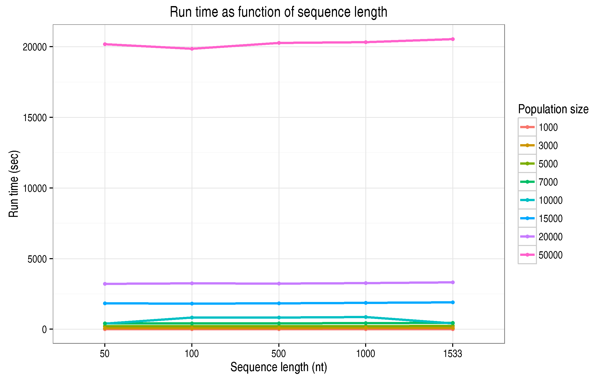
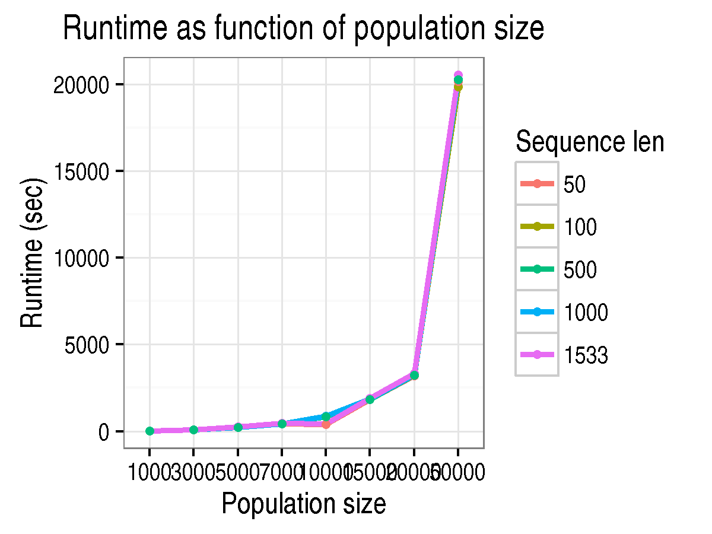

# Santa performance measures

[Wercker Application]: https://app.wercker.com/project/bykey/cc49c35fea162f30d47d1b27e10e47fb
[Wercker Build Widget]: https://app.wercker.com/status/cc49c35fea162f30d47d1b27e10e47fb/s/master "wercker status"
[SANTA Repo]: http://github.com/santa-dev/santa
[SANTA page]: http://cswarth.github.io/santa-perf/index.html

[![Wercker Build Widget]][Wercker Application]

This repo hold scripts related to measuring memory and run time performance of [SANTA][SANTA Repo], a forward-in-time viral evolution simulator.

#Methodology

Multiple SANTA simulations are configured with a range of population sizes and genome lengths.  Memory footprint and elapsed wallclock time are collected for each simulation and the results are plotted below.  All simulations are configured to run for 10,000 generations under neutral selection without fitness constriants, and without actually sampling any of the simulated sequences.

The graphs below show that genome length is not correlated with total elapsed run time.  Unsurprisingly total run time is almost exclusively determined by population size.


<br>



## Basic usage


To gather statistics and build plots that explore [SANTA][SANTA Repo] memory and runtime performance,
```
	$ scons -j 10
	$ bin/parseresults.py -o results.csv $(find output -type f -name santa.out) >results.csv
	$ plot_results.r
```
Warning: No attempt has been made to make this code portable to
environments outside the Hutch.

Running the simulations under various combinations of population size
and sequence length will take many hours to complete.  Two
optimizations are included to hopefully make this process faster.  The
`SConstruct` file uses the `srun` command from the
`[SLURM](http://slurm.schedmd.com/)` cluster management package to launch jobs on the Hutch center cluster resources.  Also,
because the heavy lifting is offloaded to the cluster, we use `-j N`
to launch multiple simulations in parallel.

Plots generated by the commands above will be left in
`bypopulation.png` and `byseqlen.png` in the current directory.

## web-aware plots and continuous integration

`bin/plot_bokeh.py` is a script that will plot the collected statistics and
produce an HMTL file that can be viewed in your web browser.  The
resulting plots can be panned, scaled, and zoomed.  See the completed bokeh plots [here](https://cswarth.github.io/santa-perf).

`wercker.yml` is a configuration file for the [Wercker](http://wercker.com/) continuous
integration platform.  This configuration file allows Wercker to build
the interactive Bokeh plots and deploy them to the
[project github pages](https://cswarth.github.io/santa-perf)
Wercker will automatically rebuild this project whenever 
this github repo is updated.  The data for the plots is taken from the `results.csv` file in this repo.

Click on the build badge above to see the current status of the
automated Wercker build. 


